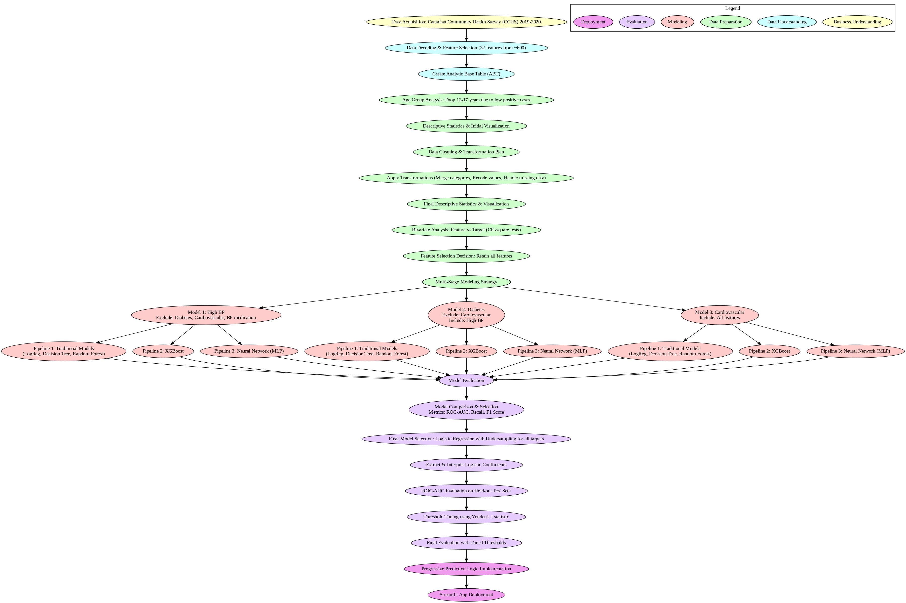
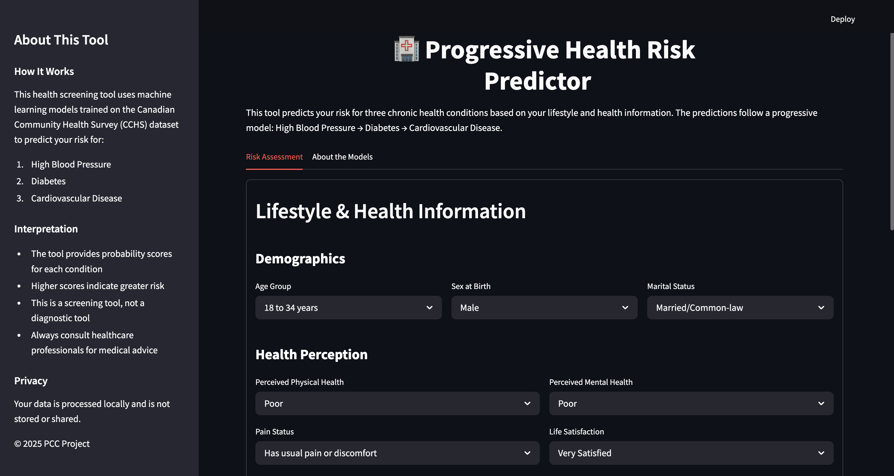
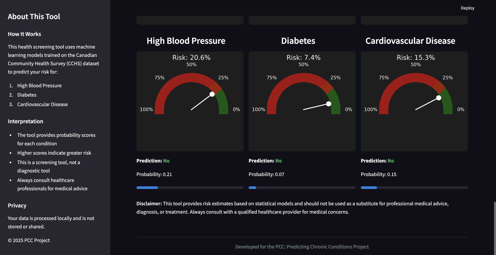
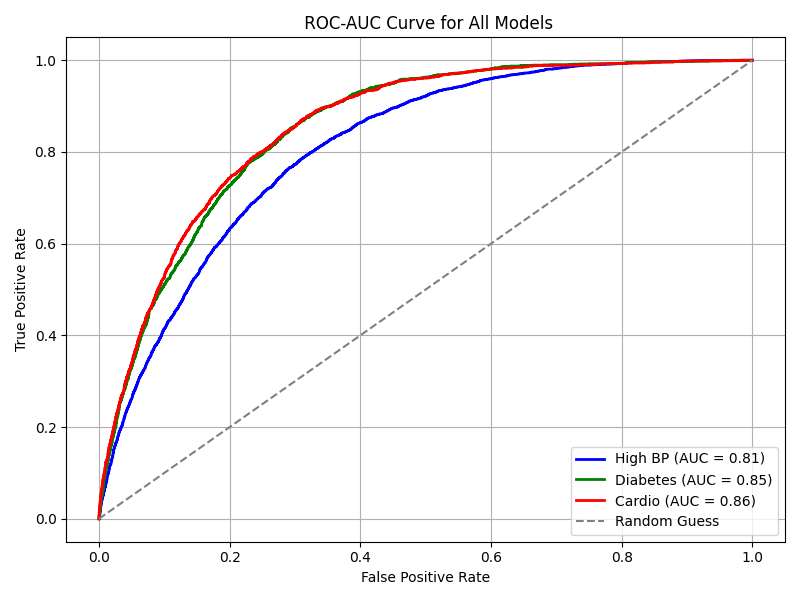
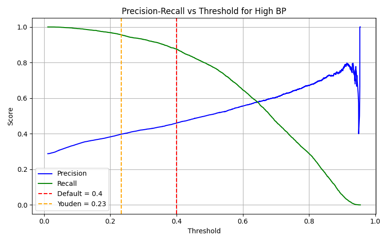
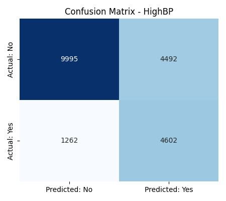

# 🩺 Health Risk Prediction
> From raw data to a deployed ML app — predicting chronic health risks using CRISP-DM.


**Health Risk Prediction** is an end-to-end data science project that predicts the likelihood of chronic health conditions — **high blood pressure, diabetes, and cardiovascular disease** — using survey data from the Canadian Community Health Survey (CCHS).

This project is built entirely from scratch, following the **CRISP-DM methodology**, and covers the complete lifecycle:
- Raw data ingestion
- Data cleaning and preprocessing
- Modeling with multiple machine learning algorithms
- Model evaluation & threshold tuning
- Deployment as an interactive **Streamlit app**

## ✨ Project Highlights

- **End-to-end CRISP-DM workflow** → covers all six phases: Business Understanding, Data Understanding, Data Preparation, Modeling, Evaluation, and Deployment.  
- **Built from raw survey data** → full pipeline starting with the Canadian Community Health Survey (CCHS).  
- **Multiple machine learning models tested**: Logistic Regression, Decision Tree, Random Forest, XGBoost, and Neural Networks.  
- **Evaluation & Tuning**: ROC-AUC, F1-score, confusion matrices, precision-recall analysis, and custom threshold optimization (Youden’s J statistic).  
- **Final model selection** → Logistic Regression chosen for interpretability and robust performance.  
- **Deployment ready** → trained models saved as `.pkl` files and integrated into an interactive **Streamlit app** for real-time predictions.  
- **Reproducible & modular** → notebooks organized step-by-step, with clear separation of statistics, plots, and metrics outputs.  

### 📊 Workflow Diagram



## 📂 Repository Structure

```bash
health-risk-prediction/
├── app/                        # Streamlit app
│   └── app.py
├── data/                       # Raw dataset (ignored in git)
│   └── sample/                 # small sample dataset for demo
├── notebooks/                  # Modular CRISP-DM workflow (01–19)
│   ├── 01_data_decoding.ipynb
│   ├── 02_data_preprocessing_part1.ipynb
│   ├── ...
│   └── 19_evaluation_custom_thresholds.ipynb
├── outputs/                    # All generated artifacts
│   ├── statistics/             # Intermediate datasets
│   ├── metrics/                # Model metrics, reports, models (.pkl)
│   └── plots/                  # Visualizations
├── summary/                    # Master end-to-end notebook
│   └── PCC_PredictingChronicConditions.ipynb
├── docs/                       # Project Report
│   └── PCC_PredictingChronicConditions.pdf
├── requirements.txt            # Dependencies
└── README.md                   # Project overview
```

## 🚀 Run the App

To launch the interactive Streamlit app:

```bash
streamlit run app/app.py
```

## 🎨 App Preview

After running the app, you can interact with the **Progressive Health Risk Predictor**.

### Input Screen
Users provide demographic and lifestyle details to assess health risks.  


### Output Screen
The app generates risk probabilities and predictions for **High Blood Pressure, Diabetes, and Cardiovascular Disease**.  



## 📊 Results & Visuals

### ROC-AUC Comparison
Models were compared using ROC-AUC to evaluate classification performance across different thresholds.  



---

### Threshold Tuning
Thresholds were optimized using **Youden’s J statistic** to balance recall and precision — especially important in a healthcare screening context.  



---

### Confusion Matrix (Final Model)
Final evaluation using custom thresholds shows balanced trade-offs between false positives and false negatives.  



## 📚 References

- [CRISP-DM Methodology](https://en.wikipedia.org/wiki/Cross-industry_standard_process_for_data_mining)  
- [Statistics Canada – Canadian Community Health Survey (CCHS)](https://www150.statcan.gc.ca/n1/en/catalogue/82M0013X)  
- [scikit-learn Documentation](https://scikit-learn.org/stable/)  
- [imbalanced-learn Documentation](https://imbalanced-learn.org/stable/)  
- [XGBoost Documentation](https://xgboost.readthedocs.io/)  
- [Streamlit Documentation](https://docs.streamlit.io/)  
